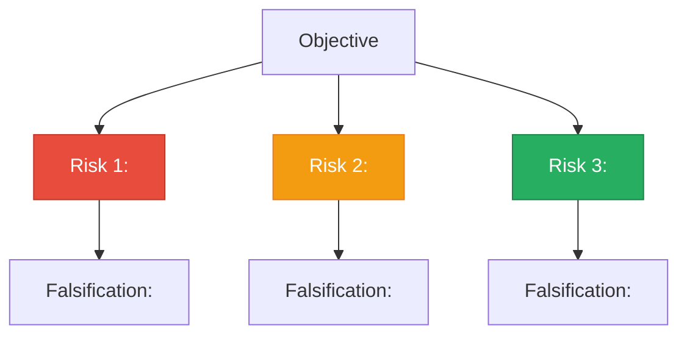

# Risk Breakdown Template

```yaml
---
type: risk-breakdown
risk-count: <integer>
highest-kill-probability: high | medium | low
date: YYYY-MM-DD
---
```

Rank by probability of invalidating the objective.

## Risk hierarchy diagram



## Top risks (3-5)

> [!danger] Risk 1: <name>
> - Kill probability: <span style="color:red">High</span> / <span style="color:#e68a00">Medium</span> / <span style="color:green">Low</span>
> - Why it can kill the program:
> - Earliest falsification test:

> [!warning] Risk 2: <name>
> - Kill probability:
> - Why it can kill the program:
> - Earliest falsification test:

> [!info] Risk 3: <name>
> - Kill probability:
> - Why it can kill the program:
> - Earliest falsification test:

## Prioritization
- Highest-risk-first order:
- Why this order:

## Immediate work queue

> [!tip] Next Actions
> - Risk #1 next action:
> - Risk #2 next action:
> - Risk #3 next action:

---

<details><summary>Plain-text version (no plugins required)</summary>

## Top risks (3-5)
1. Risk:
   - Why it can kill the program:
   - Earliest falsification test:
2. Risk:
3. Risk:

## Prioritization
- Highest-risk-first order:
- Why this order:

## Immediate work queue
- Risk #1 next action:
- Risk #2 next action:
- Risk #3 next action:

</details>
