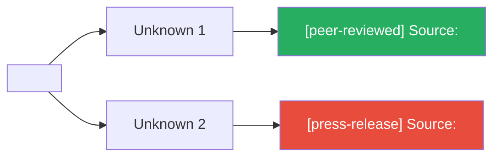

# Learn Card Template

```yaml
---
type: learn-card
topic: "<topic name>"
risk-bucket: "<linked risk>"
confidence: <0-100>
status: open | partial | resolved
unknowns-count: <integer>
date: YYYY-MM-DD
objective-link: "[[YYYY-MM-DD-objective-and-gates]]"
decision-packet-link: "[[YYYY-MM-DD-decision-packet-v0.x]]"
---
```

## Topic
- Topic name:
- Linked risk bucket: `risk-bucket:: <linked risk>`

## Unknowns (what I do not yet understand)

> [!question] Unknown 1
> - Statement:
> - Status: <span style="color:red">Open</span> / <span style="color:#e68a00">Partial</span> / <span style="color:green">Resolved</span>

> [!question] Unknown 2
> - Statement:
> - Status:

## Evidence plan

> [!example] Evidence Plan
> **Source targets:** papers/docs/experts
> Each source must include its evidence tier label (see SKILL.md step 4 tier table):
> - Source 1: `[tier label]` -- citation (PMID/DOI/URL)
> - Source 2: `[tier label]` -- citation (PMID/DOI/URL)
>
> **Evidence tier key:**
> | Tier | Label |
> |------|-------|
> | 1 | `[peer-reviewed]` |
> | 2 | `[preprint]` |
> | 3 | `[industry-report]` |
> | 4 | `[press-release]` |
> | 5 | `[unverified / no source]` |
>
> **Minimum evidence bar:**
> - At least one tier 1-2 source required for claims that drive execution decisions
> - If only tier 4-5 sources available, flag the claim as speculative

### Evidence linkage diagram

Source nodes must include the tier label. Use CSS classes to reflect both evidence strength and tier:



**Tier-to-class mapping:** tier 1-2 = `strong` (green), tier 3 = `moderate` (amber), tier 4-5 = `weak` (red)

## Teach-back (in my own words)

Format: **numbered list only** (5-10 items). Write each item as a plain, first-person statement of understanding. Use learner-direct voice: "X works by...", "The key tradeoff is...", "I was wrong about Y because..."

**Anti-patterns -- do NOT include in teach-back:**
- No graphs, tables, Mermaid diagrams, Chart.js blocks, or data visualizations
- No prose paragraphs or colloquial rambling
- No embedded evidence or source citations (those belong in the Evidence Plan section)

> [!abstract] Teach-back
> 1.
> 2.
> 3.
> 4.
> 5.

## Applied output

> [!tip] Applied Output
> - **Artifact produced:** (SOP/matrix/decision table)
> - **How it changes the active decision:**

## Confidence + gap

**Confidence cap rules (based on source quality):**
- Tier 1-2 sources only: standard range applies (0-100%)
- Tier 3 sources: cap confidence at maximum 60%
- Tier 4-5 sources only: cap confidence at maximum 35%

<progress value="0" max="100"></progress> **0%**

> [!info] Confidence Assessment
> - Confidence: `confidence:: 0`
> - Highest evidence tier available: (1-5)
> - Confidence cap applied: (Yes/No -- if yes, state cap and reason)
> - Remaining ambiguity:
> - Next action to close ambiguity:

> [!warning] Low evidence quality
> Display this callout when the highest available evidence is tier 4-5. Confidence is capped at 35% because no peer-reviewed or preprint-level evidence supports the core claims. A verification step must be the next action.

---

<details><summary>Plain-text version (no plugins required)</summary>

## Topic
- Topic name:
- Linked risk bucket:

## Unknowns (what I do not yet understand)
-
-

## Evidence plan
- Source targets (papers/docs/experts) -- each with tier label [peer-reviewed], [preprint], [industry-report], [press-release], or [unverified / no source]:
- Minimum evidence bar:
- Highest evidence tier available:

## Teach-back (in my own words)
- 5-10 bullets max:

## Applied output
- Artifact produced from this learning (SOP/matrix/decision table):
- How it changes the active decision:

## Confidence + gap
- Confidence (0-100) -- apply tier-based caps: tier 3 max 60%, tier 4-5 max 35%:
- Highest evidence tier available:
- Confidence cap applied (Yes/No):
- Remaining ambiguity:
- Next action to close ambiguity:

</details>
