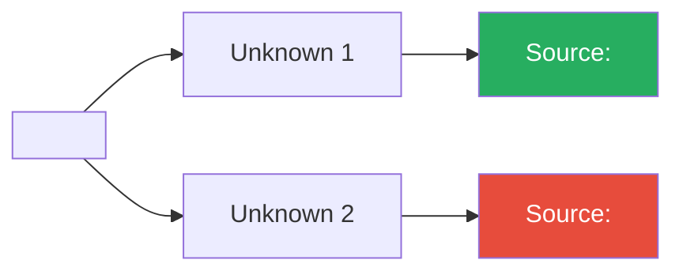

# Learn Card Template

```yaml
---
type: learn-card
topic: "<topic name>"
risk-bucket: "<linked risk>"
confidence: <0-100>
status: open | partial | resolved
unknowns-count: <integer>
date: YYYY-MM-DD
objective-link: "[[YYYY-MM-DD-objective-and-gates]]"
decision-packet-link: "[[YYYY-MM-DD-decision-packet-v0.x]]"
---
```

## Topic
- Topic name:
- Linked risk bucket: `risk-bucket:: <linked risk>`

## Unknowns (what I do not yet understand)

> [!question] Unknown 1
> - Statement:
> - Status: <span style="color:red">Open</span> / <span style="color:#e68a00">Partial</span> / <span style="color:green">Resolved</span>

> [!question] Unknown 2
> - Statement:
> - Status:

## Evidence plan

> [!example] Evidence Plan
> **Source targets:** papers/docs/experts
> - Source 1:
> - Source 2:
>
> **Minimum evidence bar:**
> -

### Evidence linkage diagram



## Teach-back (in my own words)

> [!abstract] Teach-back
> 1.
> 2.
> 3.
> 4.
> 5.

## Applied output

> [!tip] Applied Output
> - **Artifact produced:** (SOP/matrix/decision table)
> - **How it changes the active decision:**

## Confidence + gap

<progress value="0" max="100"></progress> **0%**

> [!info] Confidence Assessment
> - Confidence: `confidence:: 0`
> - Remaining ambiguity:
> - Next action to close ambiguity:

---

<details><summary>Plain-text version (no plugins required)</summary>

## Topic
- Topic name:
- Linked risk bucket:

## Unknowns (what I do not yet understand)
-
-

## Evidence plan
- Source targets (papers/docs/experts):
- Minimum evidence bar:

## Teach-back (in my own words)
- 5-10 bullets max:

## Applied output
- Artifact produced from this learning (SOP/matrix/decision table):
- How it changes the active decision:

## Confidence + gap
- Confidence (0-100):
- Remaining ambiguity:
- Next action to close ambiguity:

</details>
