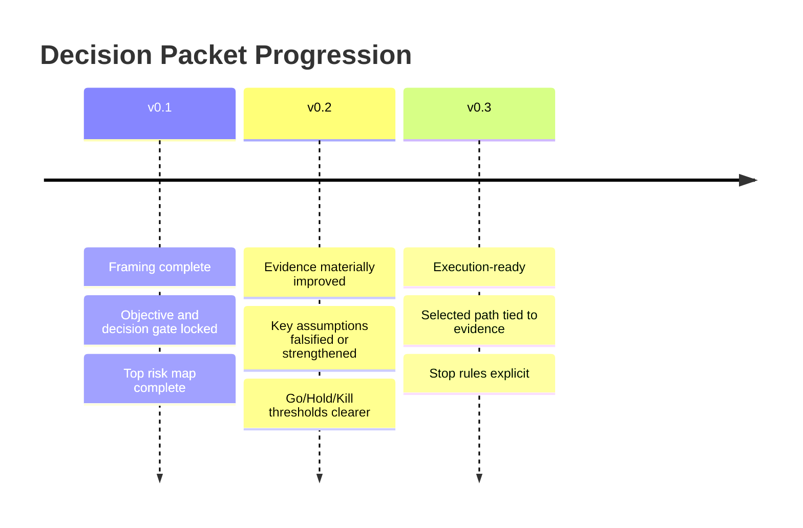

# Version Promotion Rubric (v0.1 -> v0.3)

```yaml
---
type: decision-packet
version: "0.1" | "0.2" | "0.3"
gate: go | hold | kill
decision-date: YYYY-MM-DD
evidence-count: <integer>
previous-version: "[[YYYY-MM-DD-decision-packet-v0.x]]"
---
```

## Version timeline



## v0.1 (framing complete)

> [!info] v0.1 Criteria
> - [ ] Objective and decision gate locked
> - [ ] Top risk map complete
> - [ ] Initial hypothesis and stop conditions drafted

## v0.2 (evidence materially improved)

> [!info] v0.2 Criteria
> - [ ] High-priority evidence gaps reduced
> - [ ] At least one key assumption falsified or strengthened
> - [ ] Updated Go/Hold/Kill with clearer thresholds

## v0.3 (execution-ready)

> [!success] v0.3 Criteria
> - [ ] Selected path tied to explicit evidence
> - [ ] Operational plan for day 0-7 complete
> - [ ] Stop rules and rollback triggers explicit

## Promotion note (required every version)

> [!quote] Promotion Note
> - **What changed:**
> - **Why it changed:**
> - **What remains uncertain:**

---

<details><summary>Plain-text version (no plugins required)</summary>

## v0.1 (framing complete)
Required:
- Objective and decision gate locked
- Top risk map complete
- Initial hypothesis and stop conditions drafted

## v0.2 (evidence materially improved)
Required:
- High-priority evidence gaps reduced
- At least one key assumption falsified or strengthened
- Updated Go/Hold/Kill with clearer thresholds

## v0.3 (execution-ready)
Required:
- Selected path tied to explicit evidence
- Operational plan for day 0-7 complete
- Stop rules and rollback triggers explicit

## Promotion note (required every version)
- What changed:
- Why it changed:
- What remains uncertain:

</details>
