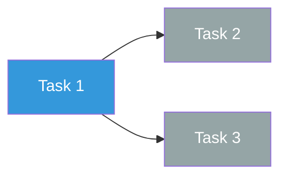

# Day 0-7 Execution Template

```yaml
---
type: execution-board
date-range: "YYYY-MM-DD to YYYY-MM-DD"
total-tasks: <integer>
completed: <integer>
blocked: <integer>
days-remaining: <integer>
---
```

## Execution objective (week 1)
-

## KPI summary

> [!info] Total Tasks
> **<count>** tasks

> [!success] Completed
> **<count>** done

> [!danger] Blocked
> **<count>** blocked

> [!warning] Days Remaining
> **<count>** days

## Timeline

```mermaid
gantt
    title Day 0-7 Execution
    dateFormat YYYY-MM-DD
    axisFormat %b %d

    section Checkpoints
    Day 1 checkpoint :milestone, m1, <date>, 0d
    Day 3 checkpoint :milestone, m3, <date>, 0d
    Day 7 checkpoint :milestone, m7, <date>, 0d

    section Tasks
    Task 1 :t1, <start>, <duration>
    Task 2 :t2, after t1, <duration>
    Task 3 :t3, <start>, <duration>
```

## Task board

For each task include owner, threshold, and stop trigger.

### Now (active)

> [!info] Task 1: <name>
> - **Owner:**
> - **Success threshold:**
> - **Stop/rollback trigger:**
> - **Dependency:**
> - **Status:** <span style="color:#3498db">In Progress</span>

### Next (queued)

> [!info] Task 2: <name>
> - **Owner:**
> - **Success threshold:**
> - **Stop/rollback trigger:**
> - **Dependency:**
> - **Status:** <span style="color:gray">Pending</span>

### Later

> [!info] Task 3: <name>
> - **Owner:**
> - **Success threshold:**
> - **Stop/rollback trigger:**
> - **Dependency:**
> - **Status:** <span style="color:gray">Pending</span>

## Task dependency diagram



## Daily readout

> [!info] Day 1 checkpoint
> - Expected:
> - Actual:
> - Status: <span style="color:green">On track</span> / <span style="color:#e68a00">At risk</span> / <span style="color:red">Behind</span>

> [!info] Day 3 checkpoint
> - Expected:
> - Actual:
> - Status:

> [!info] Day 7 checkpoint
> - Expected:
> - Actual:
> - Status:

## Escalation rules

> [!warning] Hold trigger
> Escalate to HOLD when:

> [!danger] Kill trigger
> Escalate to KILL when:

---

## Observational study execution template

When the study design is classified as **observational** or **retrospective** (see `references/01-objective-and-gates.md` study design classification), use this template instead of the standard interventional task board above.

### Incompatibility gate

Before generating any task, verify it does not require applying an intervention. If a proposed task implies treatment, vector selection, compound administration, protocol manipulation, or randomization AND the study design = observational or retrospective, do NOT include it. Instead, insert:

> [!warning] Incompatible with observational study design
> Task "<task name>" requires an intervention (treatment / manipulation / randomization) that is structurally impossible in a natural history or observational study. Replace with an observational equivalent or remove.

### Observational task categories

Use these task types for observational / natural history study execution plans:

1. **Cohort definition and inclusion/exclusion criteria finalization**
   - Define the target population
   - Specify inclusion and exclusion criteria
   - Document recruitment or data extraction strategy

2. **Endpoint and biomarker selection**
   - Identify primary and secondary endpoints
   - Select biomarkers for longitudinal tracking
   - Define measurement instruments and their validation status

3. **Data collection protocol design**
   - Design case report forms or data extraction templates
   - Specify data sources (electronic health records, registries, direct observation)
   - Define data quality checks and monitoring procedures

4. **Longitudinal follow-up schedule**
   - Define visit or data collection time points
   - Specify follow-up duration and intervals
   - Plan for loss-to-follow-up mitigation

5. **Statistical analysis plan**
   - Descriptive statistics for cohort characterization
   - Survival analysis (Kaplan-Meier, Cox regression) where applicable
   - Trajectory modeling (mixed-effects models, latent class trajectories)
   - Pre-specify sensitivity analyses
   - Define handling of missing data

---

<details><summary>Plain-text version (no plugins required)</summary>

## Execution objective (week 1)
-

## Task board
For each task include owner, threshold, and stop trigger.

1. Task:
   - Owner:
   - Success threshold:
   - Stop/rollback trigger:
   - Dependency:

2. Task:
3. Task:

## Daily readout
- Day 1 checkpoint:
- Day 3 checkpoint:
- Day 7 checkpoint:

## Escalation rules
- Escalate to HOLD when:
- Escalate to KILL when:

</details>
