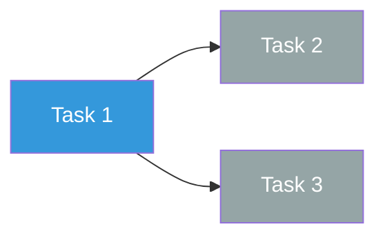

# Day 0-7 Execution Template

```yaml
---
type: execution-board
date-range: "YYYY-MM-DD to YYYY-MM-DD"
total-tasks: <integer>
completed: <integer>
blocked: <integer>
days-remaining: <integer>
---
```

## Execution objective (week 1)
-

## KPI summary

> [!info] Total Tasks
> **<count>** tasks

> [!success] Completed
> **<count>** done

> [!danger] Blocked
> **<count>** blocked

> [!warning] Days Remaining
> **<count>** days

## Timeline

```mermaid
gantt
    title Day 0-7 Execution
    dateFormat YYYY-MM-DD
    axisFormat %b %d

    section Checkpoints
    Day 1 checkpoint :milestone, m1, <date>, 0d
    Day 3 checkpoint :milestone, m3, <date>, 0d
    Day 7 checkpoint :milestone, m7, <date>, 0d

    section Tasks
    Task 1 :t1, <start>, <duration>
    Task 2 :t2, after t1, <duration>
    Task 3 :t3, <start>, <duration>
```

## Task board

For each task include owner, threshold, and stop trigger.

### Now (active)

> [!info] Task 1: <name>
> - **Owner:**
> - **Success threshold:**
> - **Stop/rollback trigger:**
> - **Dependency:**
> - **Status:** <span style="color:#3498db">In Progress</span>

### Next (queued)

> [!info] Task 2: <name>
> - **Owner:**
> - **Success threshold:**
> - **Stop/rollback trigger:**
> - **Dependency:**
> - **Status:** <span style="color:gray">Pending</span>

### Later

> [!info] Task 3: <name>
> - **Owner:**
> - **Success threshold:**
> - **Stop/rollback trigger:**
> - **Dependency:**
> - **Status:** <span style="color:gray">Pending</span>

## Task dependency diagram



## Daily readout

> [!info] Day 1 checkpoint
> - Expected:
> - Actual:
> - Status: <span style="color:green">On track</span> / <span style="color:#e68a00">At risk</span> / <span style="color:red">Behind</span>

> [!info] Day 3 checkpoint
> - Expected:
> - Actual:
> - Status:

> [!info] Day 7 checkpoint
> - Expected:
> - Actual:
> - Status:

## Escalation rules

> [!warning] Hold trigger
> Escalate to HOLD when:

> [!danger] Kill trigger
> Escalate to KILL when:

---

<details><summary>Plain-text version (no plugins required)</summary>

## Execution objective (week 1)
-

## Task board
For each task include owner, threshold, and stop trigger.

1. Task:
   - Owner:
   - Success threshold:
   - Stop/rollback trigger:
   - Dependency:

2. Task:
3. Task:

## Daily readout
- Day 1 checkpoint:
- Day 3 checkpoint:
- Day 7 checkpoint:

## Escalation rules
- Escalate to HOLD when:
- Escalate to KILL when:

</details>
