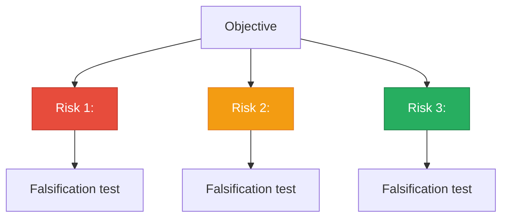
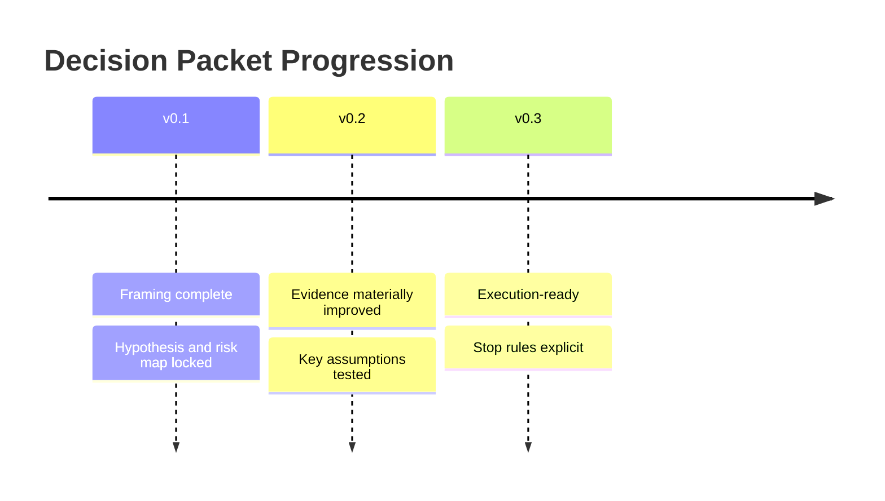
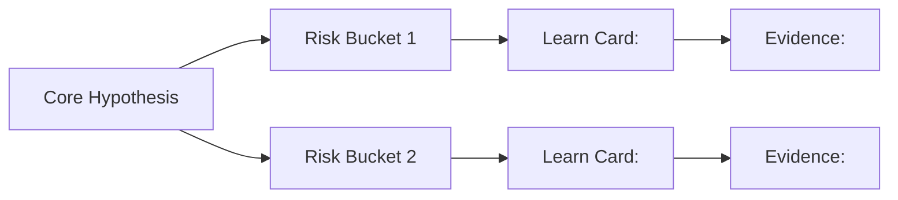
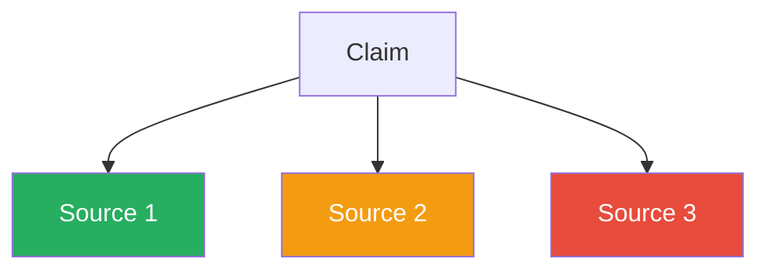
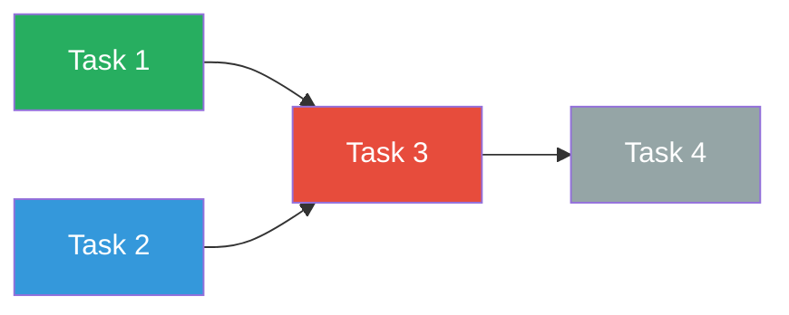

# Obsidian-Enriched Pattern Library

Reusable patterns for rendering Progressive Learning OS artifacts as rich Obsidian-native markdown. All patterns use features supported by Obsidian's core renderer or common plugins (Dataview, Charts, Kanban).

---

## A) Frontmatter Schemas

### Learn Card

```yaml
---
type: learn-card
topic: "<topic name>"
risk-bucket: "<linked risk>"
confidence: <0-100>
status: open | partial | resolved
unknowns-count: <integer>
date: YYYY-MM-DD
objective-link: "[[YYYY-MM-DD-objective-and-gates]]"
decision-packet-link: "[[YYYY-MM-DD-decision-packet-v0.x]]"
---
```

### Risk Breakdown

```yaml
---
type: risk-breakdown
risk-count: <integer>
highest-kill-probability: high | medium | low
date: YYYY-MM-DD
---
```

### Decision Packet

```yaml
---
type: decision-packet
version: "0.1" | "0.2" | "0.3"
gate: go | hold | kill
decision-date: YYYY-MM-DD
evidence-count: <integer>
previous-version: "[[YYYY-MM-DD-decision-packet-v0.x]]"
---
```

### Execution Board

```yaml
---
type: execution-board
date-range: "YYYY-MM-DD to YYYY-MM-DD"
total-tasks: <integer>
completed: <integer>
blocked: <integer>
days-remaining: <integer>
---
```

### Research Improvement Log

```yaml
---
type: research-improvement-log
date: YYYY-MM-DD
time-to-decision: "<value>"
evidence-strength-ratio: "<value>"
rework-count: <integer>
false-lead-rate: "<value>"
decision-reversals: <integer>
---
```

---

## B) Mermaid Diagram Patterns

### Risk Hierarchy Flowchart

Nodes color-coded by kill probability.

````markdown

````

### Decision Packet Version Timeline

````markdown

````

### Hypothesis-to-Risk Linkage Graph

````markdown

````

### Evidence Flow Diagram

````markdown

````

### Execution Task Dependency Graph

````markdown

````

---

## C) Callout Type Mapping

| Callout | Use case | Visual weight |
|---------|----------|---------------|
| `> [!abstract]` | Teach-back sections, executive summaries | Hero -- prominent |
| `> [!example]` | Evidence plans, source references | Supporting detail |
| `> [!tip]` | Applied outputs, artifacts produced | Accent -- positive |
| `> [!warning]` | Hold/at-risk indicators, degrading KPIs | Caution |
| `> [!danger]` | Stop triggers, kill conditions, blockers | High visual weight |
| `> [!info]` | Status updates, checkpoint summaries | Neutral |
| `> [!question]` | Remaining unknowns, ambiguity statements | Inquiry |
| `> [!success]` | Met criteria, completed tasks, Go gates | Positive confirmation |
| `> [!quote]` | Promotion notes ("what changed and why") | Reflective |
| `> [!note]+` | Collapsible detail section (expanded) | Expandable |
| `> [!note]-` | Collapsible detail section (collapsed) | Collapsed |

### Callout examples

```markdown
> [!abstract] Teach-back
> 1. X works by doing Y under condition Z.
> 2. The key tradeoff between A and B is latency vs. throughput.
> 3. I initially thought C, but evidence shows D instead.
> 4. The stop rule fires when metric M drops below threshold T.
> 5. Applied artifact: risk matrix updated with new confidence score.
>
> _Format: numbered list only. Do not embed graphs, tables, Mermaid diagrams, or data blocks in the teach-back callout._

> [!danger] Stop Rule
> If metric X drops below threshold Y, escalate to KILL.

> [!success] Promotion Gate: Go
> All v0.3 criteria met. Execution plan approved.

> [!warning] At Risk
> Evidence strength ratio below target. Review sources.

> [!question] Remaining Unknown
> How does factor X interact with constraint Y?

> [!note]- Detailed Evidence (click to expand)
> Source 1: ...
> Source 2: ...
```

---

## D) Inline HTML Components

### Confidence Gauge

```markdown
<progress value="72" max="100"></progress> **72%**
```

Color interpretation (document in the note):
- 0-30: Low confidence -- needs significant evidence
- 31-60: Moderate confidence -- key gaps remain
- 61-100: High confidence -- actionable

### Status Badge

```markdown
<span style="color:green">Resolved</span>
<span style="color:#e68a00">Partial</span>
<span style="color:red">Open</span>
```

### KPI Trend Indicator

```markdown
<span style="color:green">+12% improvement</span>
<span style="color:red">-8% degradation</span>
<span style="color:gray">No change</span>
```

### Gate Badge

```markdown
<span style="background:green;color:white;padding:2px 8px;border-radius:4px">GO</span>
<span style="background:#e68a00;color:white;padding:2px 8px;border-radius:4px">HOLD</span>
<span style="background:red;color:white;padding:2px 8px;border-radius:4px">KILL</span>
```

---

## E) Dataview Query Templates

All queries assume notes are filed under the `Progressive-Learning-OS/` vault folder with proper frontmatter.

### Learn Card Dashboard

````markdown
```dataview
TABLE
  confidence AS "Confidence",
  status AS "Status",
  unknowns-count AS "Unknowns",
  date AS "Date"
FROM "Progressive-Learning-OS/03-Learn-Cards"
WHERE type = "learn-card"
SORT confidence ASC
GROUP BY risk-bucket
```
````

### Decision Packet Tracker

````markdown
```dataview
TABLE
  version AS "Version",
  gate AS "Gate",
  evidence-count AS "Evidence",
  decision-date AS "Date"
FROM "Progressive-Learning-OS/04-Research"
WHERE type = "decision-packet"
SORT decision-date DESC
```
````

### Execution Board Summary

````markdown
```dataview
TABLE
  total-tasks AS "Total",
  completed AS "Done",
  blocked AS "Blocked",
  days-remaining AS "Days Left"
FROM "Progressive-Learning-OS/05-Execution"
WHERE type = "execution-board"
SORT date-range DESC
```
````

### KPI Trend Query

````markdown
```dataview
TABLE
  time-to-decision AS "TTD",
  evidence-strength-ratio AS "ESR",
  rework-count AS "Rework",
  false-lead-rate AS "FLR",
  decision-reversals AS "Reversals"
FROM "Progressive-Learning-OS/08-Research-Improvement"
WHERE type = "research-improvement-log"
SORT date DESC
LIMIT 7
```
````

### Cross-Reference: Learn Cards by Risk Bucket

````markdown
```dataview
LIST
FROM "Progressive-Learning-OS/03-Learn-Cards"
WHERE type = "learn-card" AND risk-bucket = this.risk-bucket
SORT confidence ASC
```
````

---

## F) Chart.js Block Patterns

Requires the Obsidian Charts plugin.

### KPI Trend Line Chart

````markdown
```chart
type: line
labels: [Day 1, Day 2, Day 3, Day 4, Day 5, Day 6, Day 7]
series:
  - title: Time-to-Decision
    data: [4.2, 3.8, 3.5, 3.1, 2.9, 2.7, 2.5]
  - title: Evidence Strength Ratio
    data: [0.4, 0.5, 0.55, 0.6, 0.65, 0.7, 0.72]
  - title: Rework Count
    data: [3, 2, 2, 1, 1, 0, 0]
  - title: False-Lead Rate
    data: [0.3, 0.25, 0.2, 0.18, 0.15, 0.12, 0.1]
  - title: Decision Reversals
    data: [1, 1, 0, 0, 0, 0, 0]
width: 80%
beginAtZero: true
```
````

### Confidence Progression Bar Chart

````markdown
```chart
type: bar
labels: [Card 1, Card 2, Card 3, Card 4]
series:
  - title: Confidence
    data: [35, 58, 72, 90]
    backgroundColor:
      - "#e74c3c"
      - "#f39c12"
      - "#27ae60"
      - "#27ae60"
width: 80%
beginAtZero: true
```
````

### Risk Distribution Radar Chart

````markdown
```chart
type: radar
labels: [Technical, Market, Regulatory, Operational, Financial]
series:
  - title: Kill Probability
    data: [0.8, 0.5, 0.3, 0.6, 0.2]
width: 60%
```
````

### Task Completion Stacked Bar Chart

````markdown
```chart
type: bar
labels: [Day 1, Day 2, Day 3, Day 4, Day 5, Day 6, Day 7]
series:
  - title: Completed
    data: [1, 2, 3, 4, 5, 6, 7]
    backgroundColor: "#27ae60"
  - title: In Progress
    data: [2, 2, 1, 1, 1, 1, 0]
    backgroundColor: "#3498db"
  - title: Blocked
    data: [1, 0, 1, 0, 0, 0, 0]
    backgroundColor: "#e74c3c"
stacked: true
width: 80%
beginAtZero: true
```
````
